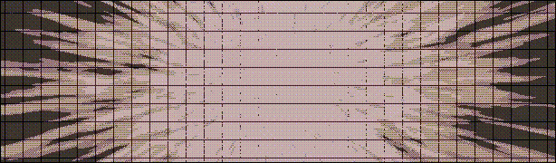

[English](./README.md) | [简体中文](./README_zh-CN.md)

# Character Flow For Blender

Character Flow is a powerful [Blender](https://www.blender.org/) addon that provides a comprehensive solution for procedural character/text animation, developed based on this excellent [BlenderAddonPackageTool](https://github.com/xzhuah/BlenderAddonPackageTool) framework. Click [here](https://github.com/3c0tr/CharacterFlow/releases/tag/preview) to download the latest version

## Main Features - every character is an independent object!
- **Visual Timeline Editing**
  - Built-in text editor supporting unlimited text content editing
  - Independent animation start and end time settings for each sentence
  - Direct import of .srt subtitle file format
  - HTML rich text markup support for adding custom properties to characters
- **Customizable Character Templates**
  - Preset character templates as animation molds
  - Create custom character templates using Blender native tools, including geometry nodes/shader nodes
  - Template system fully compatible with Blender native environment, animations remain playable after uninstalling the addon
- **One-Click Workflow**
  - Generate static character objects for all text in the content editor with one click
  - Use dynamic preview mode to preview animation effects on the current timeline in real-time
  - Automatically generate hide/show keyframe animations
- **Property Data Interface**
  - Generate fixed property data interfaces for character templates when creating character objects (see property table below)
  - Allow adding any custom properties to characters via HTML tags
  - All properties can be used as inputs for geometry nodes/shader nodes
 
## Effects you can achieve

<p align="center">
  
</p>

<p align="center">
  
</p>


## Usage Tutorial

**Before using the Character Flow addon, please understand the core concept of character templates.**

- **What is a Character Template?**  
  Character template is the core concept of the Character Flow addon, determining all characteristics of generated character objects. In Character Flow, a character template is essentially a `Blender object` (usually a `Blender text object`), and can include one layer of child objects. When the addon generates character objects, it copies a character template for each character based on the text content. If the character template or its child objects contain text objects, the text content in the generated character objects will be replaced with the specified character.

- **Node System and Character Templates**  
  As standard `Blender objects`, character templates have all Blender object properties, meaning you can add geometry nodes and shader nodes to them, unlocking unlimited possibilities for procedural creation! Combined with the property data interface of the Character Flow addon, you can achieve stunning procedural text animation effects.

**The addon comes with 7 character templates as examples, which you can use directly or refer to them to create your own character templates.**

- **Quick Start Guide**
  1. After installing the addon, find the `Character Flow` tab in the right panel of the `3D View`
  2. Open the `Character Flow` panel, click the `+` button in the top `Character Flow Controller` to create a new Character Flow instance
  3. Configure the `Character Template (Required)` and other parameters for your Character Flow instance in the `Style Editor` section. You can create a basic `Blender Text Object` as an initial character template by using `Add` -> `Text`, or use the built-in template examples
  4. Add text content and adjust animation timing in the `Content Editor` section. After enabling `Dynamic Preview`, move the timeline to preview animation effects in real-time
  5. Return to the `Character Flow Controller`, click the `Generate Static Character Flow` button to generate all character objects with one click. The generated character objects will be permanently saved in the scene

- **Property Data Interface**
  Creates default property data interfaces for character templates when creating character objects (see property table below)
  Allows you to add any custom properties to characters via HTML tags
  All properties can be used as inputs for geometry nodes/shader nodes
  
  ```
  | Property Name | Data Type | Description |
  | ------------- | --------- | ----------- |
  | enter         | Float     | Difference between current time and paragraph start time |
  | exit          | Float     | Difference between current time and paragraph end time |
  | extra         | Float     | Extra time for the text paragraph |
  | char          | String    | Current character |
  | order         | Integer   | Order of current sentence among all sentences |
  | span          | Float     | Duration of text paragraph |
  | idx           | Integer   | Index of current character in text paragraph |
  | ridx          | Integer   | Reverse index of current character in text paragraph |
  | i_ratio       | Float     | Index ratio of current character in text paragraph |
  | count         | Integer   | Total number of characters in text paragraph |
  | width         | Float     | Sum of widths of all characters in current line |
  | run           | Float     | X-coordinate position of current character in current line |
  | col           | Integer   | Column number of current character in text paragraph |
  | row           | Integer   | Row number of current character in text paragraph |
  | cols          | Integer   | Total number of columns in current line |
  | rows          | Integer   | Total number of rows in text |
  | rand          | Float     | Unique hash random number 0~1 for each character |
  ```

- **Creating Animations with Geometry Nodes**

  You can add geometry nodes to the character template and its child objects to create animation effects. When the plugin generates character objects, it will look for geometry nodes attached to the character template and modify the data in input interfaces with specified names to match the values from the additional property data interfaces with the same names.

  For API interface details, refer to the [Property Data Interface] above. To access these in geometry nodes, follow these steps:

  1. Enter the geometry node editor, find the [Group] panel on the right (if not visible, click the dropdown menu)
  2. In the [Group] panel, find the [Data Interface] panel, click (New Item) to add a new input interface
  3. Change the name of the newly created interface to the property name you want to access, such as "enter", "idx", etc...

- **Creating Animations with Shader Nodes**

  You can add shader nodes to the character template and its child objects to create animation effects. When the plugin generates character objects, it will attach all additional property data as custom attributes to the character objects.

  For API interface details, refer to the [Property Data Interface] above. To access these in shader nodes, follow these steps:

  1. Enter the shader node editor, create a new attribute node (Add->Input->Attribute)
  2. Change the name in the attribute node to the property name you want to access, change the type to [Float], such as "enter", "idx", etc...

- **Adding Custom Properties via HTML Tags**

  You can add custom properties to characters via HTML tags, using the same method as the [Property Data Interface]. Custom property names can be arbitrary, as the data type is automatically inferred from the content on the right side of the equals sign.

  Here are some examples:
  
  ```
  <scale = 1.45>hello world</scale>      | A float property named "scale" with value 1.45
  <xyz = (1.3,-0.5,0)>hello world</xyz>  | A vector property named "xyz" with value (1.3,-0.5,0)
  <color = #FF00FF>hello world</color>   | A color property named "color" with value (1,0,1)
  <is_enable = false>hello world</is_enable> | A boolean property named "is_enable" with value False
  <border>hello world</border>           | A marker property named "border" with value True
  <awwdff = "what">hello world</awwdff>  | A string property named "awwdff" with value "what"
  ```
- **Preset HTML Tags**

  The addon provides some preset HTML tags for operations that are difficult to access:
  
  ```
  <Font = "Arial Black">hello world</Font>    | This tag automatically sets the character's font to "Arial Black"
  <Size = 1.33>hello world</Size>             | This tag automatically enlarges the character's size by 1.33 times
  ```

- **Text Line Breaks**

  You can use double vertical bars in text to create line breaks:
  
  ```
  hello ||world                               | hello will be on line 1, world will be on line 2
  ```
## Other Information
  Character Flow is an addon still under development, and there may still be many issues. Some features may be adjusted. Suggestions and bug reports are welcome, contact me: **mc0tr256@163.com**


