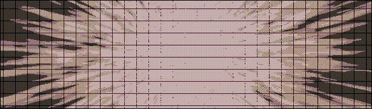

[English](./README.md) | [简体中文](./README_zh-CN.md)

# Character Flow Blender字符流插件

字符流是一个功能强大的 [Blender](https://www.blender.org/) 插件，为程序化字符/文本动画提供全面的解决方案，基于[BlenderAddonPackageTool](https://github.com/xzhuah/BlenderAddonPackageTool)这个出色的框架开发。点击[这里](https://github.com/3c0tr/CharacterFlow/releases/tag/preview)获取最新版本。

## 主要特性 - 每一个字符都是独立的物体！
- **可视化时间轴编辑**
  - 内置文本编辑器支持无限量文本内容编辑
  - 可为每条语句独立设置动画开始时间与结束时间
  - 支持直接导入 .srt 字幕文件格式
  - 支持 HTML 富文本标记，可为字符附加自定义属性
- **可定制字符模板**
  - 提供预设字符模板作为动画模具
  - 使用 Blender 原生工具自定义制作字符模板，包括几何节点/着色器节点
  - 模板系统完全兼容 Blender 原生环境，卸载插件后动画仍可正常播放
- **一键式工作流**
  - 一键为所有在内容编辑器中的文本生成静态字符物体
  - 可使用动态预览模式实时预览当前时间轴的动画效果
  - 自动生成隐藏/显示关键帧动画
- **属性数据接口**
  - 创建字符物体时为字符模板生成固定属性数据接口（详见下方属性表格）
  - 允许你通过 HTML 标签为字符附加任何自定义属性
  - 所有属性均可被几何节点/着色器节点作为输入

## 能够做到的效果

<p align="center">
  
</p>

<p align="center">
  
</p>

<p align="center">
  
</p>


## 使用教程

**在使用字符流插件前，请先了解字符模板的核心概念。**

- **什么是字符模板？**  
  字符模板是字符流插件的核心概念，它决定了生成字符物体的所有特性。在字符流中，字符模板本质上是一个 `Blender 物体`（通常是 `Blender 文本物体`），并可以包含一层子物体。当插件生成字符物体时，会根据文本内容为每个字符单独复制一个字符模板。如果字符模板或其子物体中包含文本物体，生成的字符物体中的文本内容将被替换为指定字符。

- **节点系统与字符模板**  
  作为标准的 `Blender 物体`，字符模板拥有所有 Blender 物体属性，这意味着你可以为其添加几何节点和着色器节点，开启程序化创作的无限可能！结合字符流插件的属性数据接口，你可以实现令人惊叹的程序化文本动画效果。

**插件内置了7个字符模板作为示例，你可以直接使用它们，也可以参考它们来制作自己的字符模板。**

- **快速上手指南**
  1. 安装插件后，在 `3D视图` 右侧面板中找到 `字符流` 选项卡
  2. 打开 `字符流` 面板，在顶部的 `字符流控制器` 中点击 `+` 按钮创建新的字符流实例
  3. 在 `样式编辑器` 部分为你的字符流实例配置 `字符模板(必选)` 及其他参数。你可以通过 `添加` -> `文本` 创建一个基础的 `Blender 文本物体` 作为初始字符模板，或使用插件内置的模板示例
  4. 在 `内容编辑器` 部分添加文本内容并调整动画时间。启用 `动态预览` 后，移动时间轴即可实时预览动画效果
  5. 返回 `字符流控制器`，点击 `生成静态字符流` 按钮，即可一键生成所有字符物体。生成后的字符物体将永久保存在场景中

- **属性数据接口**
  创建字符物体时为字符模板生成默认属性数据接口(详见下方属性表格)
  允许你通过 HTML 标签为字符附加任何自定义属性
  所有属性均可被几何节点/着色器节点作为输入
  
  ```
  | 属性名称 | 数据类型 | 描述 |
  | -------- | -------- | -------- |
  | enter    | 浮点     | 当前时间与文本段落开始时间的差值 |
  | exit     | 浮点     | 当前时间与文本段落结束时间的差值 |
  | extra    | 浮点     | 文本段落的额外时间 |
  | char     | 字符串   | 当前字符 |
  | order    | 整数     | 当前句子在所有句子中的顺序 |
  | span     | 浮点     | 文本段落持续时间 |
  | idx      | 整数     | 当前字符在文本段落中的索引 |
  | ridx     | 整数     | 当前字符在文本段落中的反向索引 |
  | i_ratio  | 浮点     | 当前字符在文本段落中的索引比值 |
  | count    | 整数     | 文本段落中的字符总数 |
  | width    | 浮点     | 当前行中的所有字符的宽度总和 |
  | run      | 浮点     | 当前字符在当前行中的X坐标位置 |
  | col      | 整数     | 当前字符在文本段落中的列号 |
  | row      | 整数     | 当前字符在文本段落中的行号 |
  | cols     | 整数     | 当前行的总列数 |
  | rows     | 整数     | 文本的总行数 |
  | rand     | 浮点     | 每个字符唯一的哈希随机数0~1 |
  ```

- **使用几何节点制作动画**

  你可以通过几何节点添加到文字模板上，以及文字模板上的子物体上，来制作动画效果。在插件生成字符物体的时候，它会查找文字模板上携带的几何节点，并将指定名称的输入接口中的数据修改为相同名称的额外属性数据接口中的值。

  接口API详情参考上方的[属性数据接口]，要想在几何节点中获取它们，请参考以下的操作流程：

  1. 进入几何节点编辑器，找到右侧的[群组]面板(如果没找到，可以点击下拉菜单)
  2. 在[群组]面板中，找到[数据接口]面板，点击(新建条目)添加一个新的输入接口
  3. 将刚刚创建的接口名称改为你所需获取的属性名称，比如"enter"、"idx"等...

- **使用着色器节点制作动画**

  你可以将着色器节点添加到文字模板上，以及文字模板上的子物体上，来制作动画效果。在插件生成字符物体的时候，它会将所有的额外属性数据作为自定义属性附加到字符物体上。

  接口API详情参考上方的[属性数据接口]，要想在着色器节点中获取它们，请参考下方的操作流程：

  1. 进入着色器节点编辑器，创建一个新的属性节点(添加->输入->属性)
  2. 将属性节点中的名称改为你所需获取的属性名称，类型修改为[浮点]，比如"enter"、"idx"等...


- **通过HTML标签添加自定义属性**

  你可以通过HTML标签为字符附加自定义属性，使用方式与[属性数据接口]相同。自定义属性的名字可以随意命名，因为属性的数据类型是根据等号右边的内容自动推断的。

  以下是一些示例：
  
  ```
  <scale = 1.45>hello world</scale>      | 一个名为"scale"的浮点属性，值为1.45
  <xyz = (1.3,-0.5,0)>hello world</xyz>  | 一个名为"xyz"的矢量属性，值为(1.3,-0.5,0)
  <color = #FF00FF>hello world</color>   | 一个名为"color"的颜色属性，值为(1,0,1)
  <is_enable = false>hello world</is_enable> | 一个名为"is_enable"的布尔属性，值为False
  <border>hello world</border>           | 一个名为"border"的标记属性，值为True
  <awwdff = "what">hello world</awwdff>  | 一个名为"awwdff"的字符串属性，值为"what"
  ```
- **预设HTML标签**

  插件提供了一些预设的HTML标签，用于一些难以触及的操作：
  
  ```
  <Font = "Arial Black">hello world</Font>    | 这个标签会自动将字符的字体设置为"Arial Black"
  <Size = 1.33>hello world</Size>             | 这个标签会自动将字符的大小放大原来的1.33倍
  ```

- **文本换行**

  你可以在文本中使用双竖线来创建换行：
  
  ```
  hello ||world                               | hello会在第1行，world会在第2行
  ```
## 其他信息
  字符流是一个还在开发中的插件，目前可能还存在许多问题，部分功能可能会进行调整，欢迎提出建议和bug反馈，联系我：**mc0tr256@163.com**
